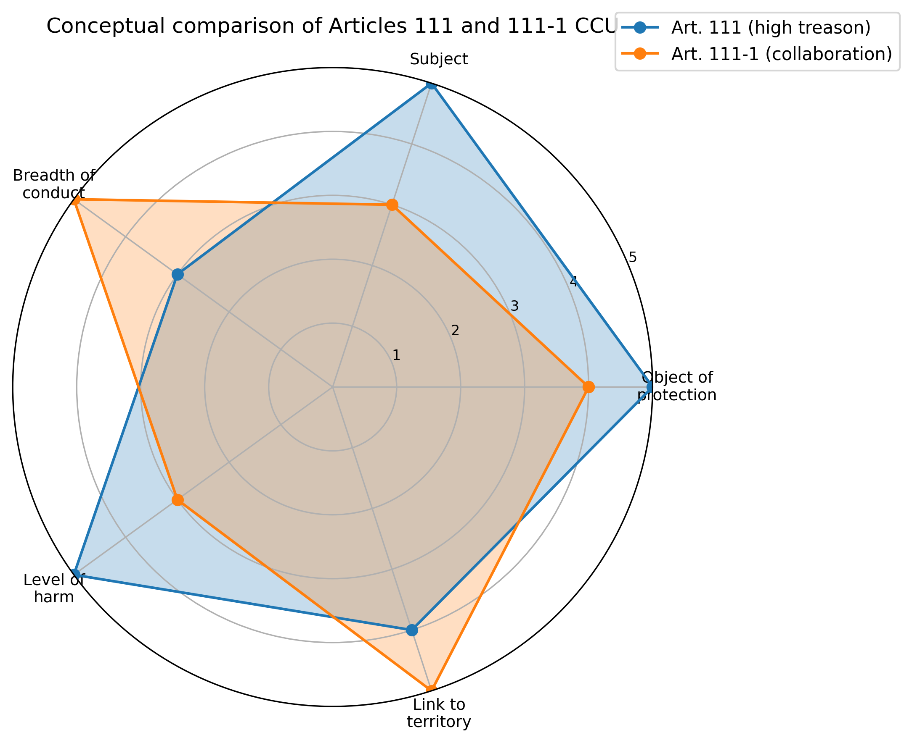
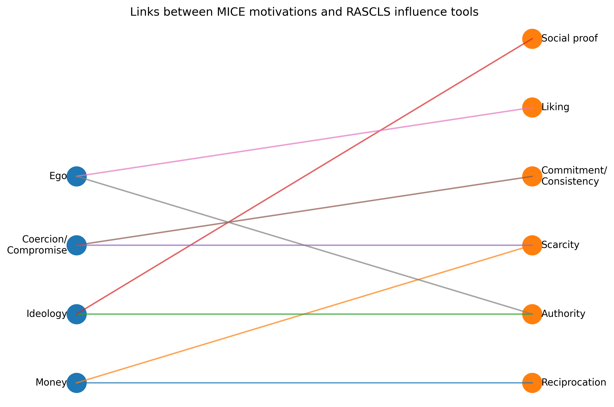
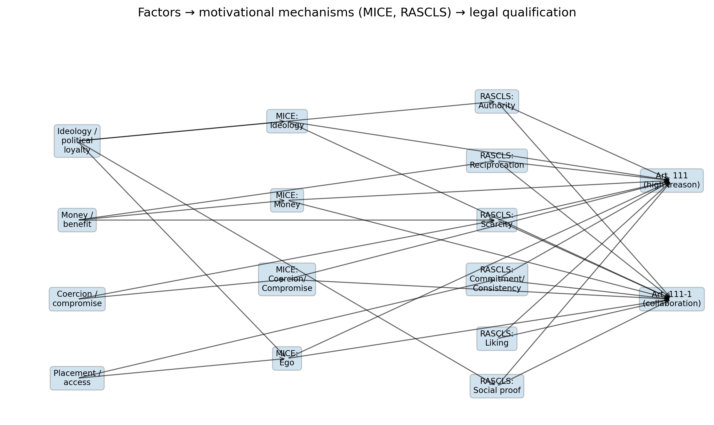

# Article 111 CCU (High Treason): Factors, MICE/RASCLS Models and Case-Based Visualisations

This folder contains an analytical mini–project on **high treason (Article 111 of the Criminal Code of Ukraine)** and its relationship to **collaboration (Article 111-1)**, using:

- legal analysis and doctrinal distinction between Articles 111 and 111-1;
- intelligence–style motivational model **MICE** (Money, Ideology, Coercion/Compromise, Ego);
- influence and recruitment model **RASCLS** (Reciprocation, Authority, Scarcity, Commitment/Consistency, Liking, Social proof);
- a **case-based, manually coded dataset** built from open sources on the suspicion of high treason against MP **Oleksandr Dubinsky**.

---

## 1. Legal framework: what does Article 111 CCU actually cover?

### 1.1. Definition of high treason

According to the Criminal Code of Ukraine, **high treason (Article 111)** is:

> *Deliberate acts committed by a citizen of Ukraine to the detriment of the sovereignty, territorial integrity, inviolability, defence capability, state, economic or information security of Ukraine.*

Key legal elements:

- **Subject** – only a **citizen of Ukraine** can commit high treason. Foreigners and stateless persons fall under other provisions (e.g. espionage, assisting the aggressor).
- **Object of protection** – the fundamental interests of the state:
  - sovereignty and territorial integrity;
  - defence capability and military security;
  - state, economic and information security.
- **Objective side (forms of conduct)** – for example:
  - going over to the side of the enemy;
  - espionage (collecting and transferring information to a foreign state);
  - providing assistance to a foreign state, organisation or their representatives in subversive activities against Ukraine.
- **Subjective side** – **direct intent**: the person is aware that the act harms Ukraine’s fundamental interests and wants (or consciously allows) such harm.

### 1.2. Sanctions and wartime specifics

The law distinguishes between **peacetime** and **wartime** treason:

- In peacetime, high treason is punishable by **12–15 years of imprisonment**, with possible confiscation of property.
- Under **martial law**, the penalty increases up to **15 years or life imprisonment** with mandatory confiscation of property.

There is also a specific **ground for exemption**: a citizen who did not take any actions to fulfil the criminal task and voluntarily informed the authorities about their contact with foreign intelligence and the task received may be released from criminal liability.

These norms reflect that high treason is one of the **gravest crimes** in the Ukrainian criminal system, aimed at protecting core national interests.

### 1.3. Relationship with Article 111-1 (collaboration)

Article **111-1** introduces liability for **collaboration activities**. In general terms:

- 111-1 covers a **broader range of behaviours** in favour of the aggressor state (e.g. participation in occupation administrations, information propaganda, economic cooperation with the occupation authorities).
- The typical subject may be **any citizen of Ukraine**, and in some parts – any person (including non-citizens).
- Many acts under 111-1 occur specifically on **temporarily occupied territories** (TOT).

In practice, some conduct may potentially be qualified either as high treason (111) or collaboration (111-1), depending on:

- whether there is direct intent to harm national security at a state-wide level;
- what exactly was done (subversive activity vs “routine” collaboration on TOT);
- the role, position and access of the person.

---

## 2. Conceptual comparison: Article 111 vs Article 111-1

To make the legal distinctions more intuitive, we build a **conceptual radar chart** that compares several dimensions:

- Object of protection
- Subject (citizen of Ukraine vs broader)
- Breadth of conduct (narrow but high-impact vs wider set of acts)
- Typical level of danger
- Link to territory (all Ukraine vs focus on TOT)

### Figure 1. Conceptual comparison of Articles 111 and 111-1 CCU



In this illustrative chart:

- **Art. 111** appears as **narrower but “deeper”** – fewer types of conduct but higher typical harm and more direct threat to state security.
- **Art. 111-1** is **broader** in terms of everyday collaboration acts but often with lower typical harm (though some parts also allow for very severe punishment).

---

## 3. Motivational model MICE and influence model RASCLS

### 3.1. MICE: core motives behind treason and collaboration

The **MICE** model is widely used in intelligence to describe why people cooperate with a hostile service:

- **Money** – financial gain, material benefits (direct payments, access to resources, corruption).
- **Ideology** – political or ideological beliefs (pro-Russian orientation, anti-Western positions, etc.).
- **Coercion / Compromise** – blackmail, threats, compromising information.
- **Ego** – ambition, desire for power, recognition, “being important”.

For high treason (Art. 111), these motives often combine:

- financial and ideological motives;
- ego (status, influence);
- sometimes coercion/compromise (when the person is forced or blackmailed).

### 3.2. RASCLS: tools used to recruit and control agents

The **RASCLS** model describes **how** people are influenced and recruited:

- **Reciprocation** – “you owe us”: creating obligations by giving money, help or protection.
- **Authority** – pressure or legitimacy of institutions, leaders, formal roles.
- **Scarcity** – lack of resources or alternatives (economic hardship, life on TOT).
- **Commitment / Consistency** – pressure to remain consistent with past choices, statements, loyalties.
- **Liking** – personal sympathy towards handlers, party or group.
- **Social proof** – “everyone does it”, seeing others in the same circle doing similar things.

In the context of high treason, these tools help explain **how technical capabilities and legal access** are converted into **actual harmful actions** in favour of the enemy.

### Figure 2. Links between MICE motivations and RASCLS influence tools



The scheme shows, for example:

- how **Money** relates to **Reciprocation** and **Scarcity**;
- how **Ideology** connects to **Authority** and **Social proof**;
- how **Ego** interacts with **Authority** and **Liking**;
- how **Coercion/Compromise** may be associated with **Scarcity** and a forced form of **Commitment**.

---

## 4. From factors to legal qualification

Article 111 is not only about *what* a person did, but also *how* and *why*. We can think in terms of a chain:

> **Context / factor → motivational mechanisms (MICE, RASCLS) → specific acts → legal article (111 vs 111-1)**

Important contextual factors:

- **Ideology / political loyalty** – pro-Russian beliefs, rejection of Ukrainian sovereignty.
- **Money / benefit** – direct funding or economic advantages.
- **Coercion / compromise** – fear, blackmail, threats.
- **Placement / access** – formal position that gives strategic access to decisions or information.

These factors are translated through MICE/RASCLS mechanisms into actual conduct: providing information, participating in influence networks, joining enemy forces, working in occupation administrations, etc.

### Figure 3. Factors → MICE/RASCLS mechanisms → legal qualification



The diagram is intentionally simplified, but it shows:

- which factors activate which **MICE** motives and **RASCLS** tools;
- how they can ultimately lead to conduct that falls under **Art. 111** (high treason) or **Art. 111-1** (collaboration).

---

## 5. Case-based analysis: Dubinsky high treason suspicion

### 5.1. Source and scope

For the case-based part (Variant B) we rely on open-source reporting about the **suspicion of high treason** brought against **Oleksandr Dubinsky**, Ukrainian MP and media figure.

According to media and official statements (summarised):

- he allegedly **belonged to an information-influence network** coordinated by Russian military intelligence (GRU);
- the network conducted information-sabotage operations against Ukraine, including press conferences and public events with messaging aligned to Russian interests;
- the network reportedly **received substantial funding** from GRU, and its members were paid for their participation;
- Dubinsky had long-standing **media and political influence**, using his platforms (TV, social media, parliament) to promote narratives overlapping with Russian propaganda lines.

> This README does not reproduce all details of the case; it focuses on how such a case can be **analytically coded** into MICE and RASCLS factors.

### 5.2. Manual factor coding

The file `treason_mice_rascls_analysis.py` creates a small DataFrame with a single case:

```text
case    = "Oleksandr Dubinsky"
type    = "Member of Parliament / media figure"
article = "111"   (suspicion of high treason)


**Module docs & code**

- Full explanation (legal context, models, methodology):  
[`info/111/README.md`](info/111/README.md)  
- Script that generates all figures:  
[`info/111/treason_mice_rascls_analysis.py`](info/111/treason_mice_rascls_analysis.py)

**Figures**

- **Figure 1 – Conceptual comparison of Articles 111 and 111-1**  
  Radar chart comparing high treason vs collaboration across several conceptual dimensions  
  (object of protection, subject, breadth of conduct, level of danger, link to territory).  
[Figure 1](info/111/fig_111_radar_articles.png)

- **Figure 2 – MICE ↔ RASCLS map**  
  Bipartite diagram linking core motives (Money, Ideology, Coercion, Ego) to influence tools  
  (Reciprocation, Authority, Scarcity, Commitment/Consistency, Liking, Social proof).  
[Figure 2](info/111/fig_111_mice_rascls_map.png)

- **Figure 3 – Factors → mechanisms → legal qualification**  
  Flow diagram showing how context factors (ideology, money, coercion, placement/access)  
  are channelled through MICE/RASCLS mechanisms into conduct that may fall under  
  Article 111 or 111-1.  
[Figure 3](info/111/fig_111_flow_factors_mice_rascls.png)

- **Figure 4 – Factor frequencies (Dubinsky pilot coding)**  
  Bar chart of which MICE/RASCLS factors are coded as present/absent for the  
  Dubinsky high-treason suspicion case (manual 0/1 coding based on open sources).  
[Figure 4](info/111/fig_111_bar_factor_frequency.png)

- **Figure 5 – MICE profile by actor type**  
  MICE profile for the actor type **“Member of Parliament / media figure”** in the pilot dataset.  
  Designed to scale to multiple actor types as more cases are added.  
[Figure 5](info/111/fig_111_bar_mice_by_type.png)

- **Figure 6 – Factor profiles by article (111 vs 111-1)**  
  Radar chart of average factor values by article. Currently shows only the  
  **Art. 111** profile (Dubinsky case); will automatically plot Art. 111-1 once such cases  
  are added to the dataset.  
[Figure 6](info/111/fig_111_radar_profiles_by_article.png)
