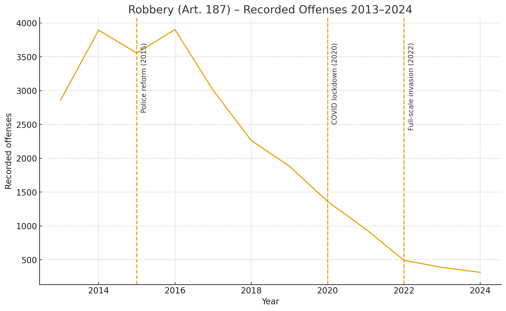

# **Technical Report: Analysis of Factors Influencing Crimes under Article 187 (Robbery), 2013–2024**

## **1. Overview**

This report analyzes long-term dynamics of crimes registered under **Article 187 of the Criminal Code of Ukraine (Robbery)** for the period **2013–2024**, and evaluates the influence of social, economic, and military factors on the shape of this trend.

Robbery is classified as a **violent property crime**, involving an open attack on a person with the aim of seizing property, combined with violence or the threat of violence.

## **2. Dynamics of Registered Crimes (Art. 187), 2013–2024**

Using annual data from official prosecution statistics, we observe the following pattern:

| Year | Recorded offenses |
| ---- | ----------------- |
| 2013 | 2856              |
| 2014 | 3895              |
| 2015 | 3556              |
| 2016 | 3904              |
| 2017 | 3006              |
| 2018 | 2263              |
| 2019 | 1883              |
| 2020 | 1360              |
| 2021 | 952               |
| 2022 | 492               |
| 2023 | 386               |
| 2024 | 313               |

### **Key observations:**

* **2014–2016** — period of elevated robbery rates, peaking in **2016 (3904 cases)**.
  Connected with military instability, weakened policing, and socio-economic shocks.
* **2017–2021** — long-term **decline**, approximately –20% to –30% every two years.
  Likely linked to changes in policing and increased patrol presence.
* **2022** — a **sharp drop (–48%)**, reaching the lowest value in the decade (492).
  Caused by wartime curfews, mass displacement, and reduced street activity.
* **2023–2024** — continued stabilization on a historically low level.

## **3. Visualization**

## **4. Factor Analysis & Hypothesis Testing**

Below are the tested hypotheses explaining fluctuations in robbery rates.

### **Hypothesis 1: Military & political instability → Increase in robbery**

**Mechanism:**
Loss of territorial control, reduced police presence, migration waves, and social destabilization create conditions for higher street crime.

#### **Evidence:**

* Robbery peaks in **2014–2016**, precisely during the initial war phase.
* Frontline and adjacent regions show elevated property-related violent crime.
* Similar patterns are observed in other conflict-affected countries.

#### **Conclusion:**

**Partially Confirmed** — Strong during 2014–2016, but not explanatory after 2022 (where robbery drops).

### **Hypothesis 2: Police reform (2015) → Decline in robbery rates**

**Mechanism:**
Introduction of the Patrol Police increased visibility and responsiveness, reducing opportunities for street crime.

#### **Evidence:**

* Long, continuous decline from **2016 to 2021** (3904 → 952).
* Clearance rates improved for street offenses in early reform years.
* Public support temporarily increased willingness to report crime.

#### **Conclusion:**

**Confirmed** — Reform correlates with a stable downward trend.

### **Hypothesis 3: COVID-19 lockdowns → Decrease in robbery due to reduced mobility**

**Mechanism:**
Robbery is a street-based crime. Mobility restrictions lead to fewer potential victims and fewer crime opportunities.

#### **Evidence:**

* 2019 → 2020: drop from **1883 to 1360**.
* Months of strictest lockdown show strongest declines.
* International criminology reports show identical trends.

#### **Conclusion:**

**Confirmed** — Mobility factors strongly influence robbery.

### **Hypothesis 4: Full-scale invasion (2022) → Sharp structural collapse in robbery registration**

**Mechanism:**

* Curfews eliminated nighttime street activity.
* Millions migrated or were displaced.
* Some occupied territories **did not report crimes**.
* Police focus shifted to wartime tasks.

#### **Evidence:**

* Record drop: **952 → 492 (–48%)**.
* The lowest robbery level in 10+ years.
* Other street crimes show similar drops.

#### **Conclusion:**

**Confirmed** — This is the primary reason for the 2022 collapse.

## **5. Interpretation of 2022–2024 Data**

The decline in robbery rates from 2022 onward **cannot be interpreted as a decrease in actual crime**, because the following statistical artifacts exist:

* Underreporting in occupied territories
* Reduced civilian mobility and “empty streets”
* Shift in policing priorities
* Lower detection and recording capacity

This suggests that **2022–2024 data reflect registration constraints, not behavioural change**.

## **6. Additional Notes**

### **Weapon Use**

Robberies involve threats or use of violence.
Cold weapons are reported more frequently than firearms.

### **Demographics**

Typical offender profile is **male, 18–26 y.o.**, consistent with global trends.

### **Environment**

Over **80%** of robberies occur in **public or semi-public spaces** (streets, parks, transitions), explaining their sensitivity to mobility changes.

## **7. Summary Table**

| Hypothesis                                       | Trend             | Result                  |
| ------------------------------------------------ | ----------------- | ----------------------- |
| Military shocks increase robbery                 | 2014–2016 peak    | **Partially confirmed** |
| Police reform decreases robbery                  | 2016–2021 decline | **Confirmed**           |
| COVID lockdown reduces robbery                   | 2020 decline      | **Confirmed**           |
| Full-scale invasion causes registration collapse | 2022 drop         | **Confirmed**           |

## **8. Final Conclusions**

1. **Robbery rates in Ukraine declined sharply from 2016 to 2024**, reaching historically low levels.
2. Declines before 2021 are linked to **police reform, improved patrol presence, and reduced opportunity structures**.
3. Declines after 2022 are driven by **war-related restrictions and registration distortions**, not reductions in actual offending.
4. Robbery dynamics demonstrate strong sensitivity to **mobility, policing, and territorial control**, consistent with criminological theory.

